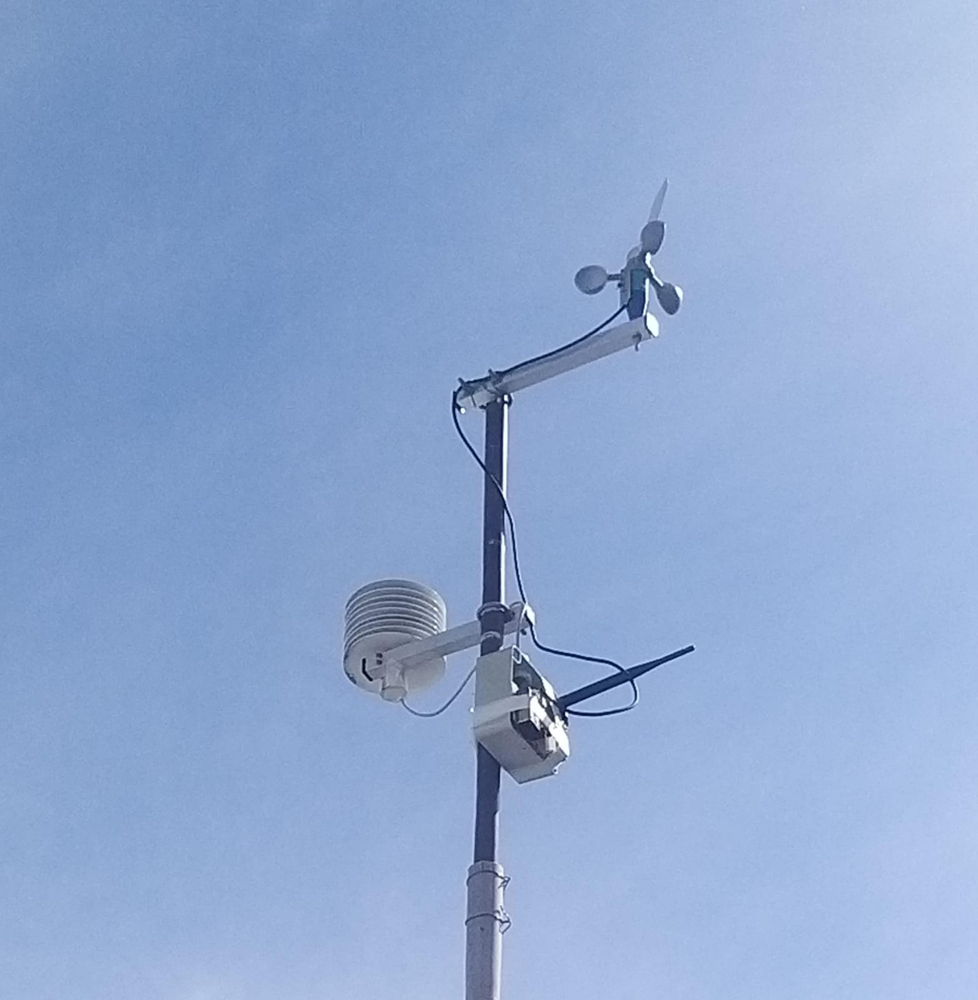

<h1>Estação Meteorológica Microcontrolada</h1>

    

As estações meteorológicas são equipamentos utilizados para monitoramento e registro de condições climáticas por meio de sensores que analisam parâmetros atmosféricos como temperatura, umidade, pressão, velocidade e direção do vento. Neste projeto, os sensores estão conectados a um microcontrolador responsável por realizar a leitura dos dados. Esses dados são enviados automaticamente por protocolo LoRa(Long Range) para um servidor remoto (Datalogger), que realiza o armazenamento e processamento das informações.

O sistema foi projetado para operar continuamente e com baixo consumo de energia, sendo ideal para aplicações em ambientes externos. A visualização dos dados é feita por meio de dashboards acessíveis via navegador, possibilitando o acompanhamento em tempo real das variáveis monitoradas.

<h2>Tecnologias Utilizadas</h2>

<ul>
    <li><strong>MQTT (Eclipse Mosquitto):</strong> protocolo leve de comunicação utilizado para transmitir os dados dos sensores de forma eficiente e confiável.</li>
    <li><strong>Node.js:</strong> ambiente de execução utilizado no backend para processar as mensagens recebidas e integrá-las aos demais componentes do sistema.</li>
    <li><strong>Node-RED:</strong> ferramenta baseada em fluxo que facilita a criação de integrações entre os dados do MQTT e os bancos de dados utilizados.</li>
    <li><strong>InfluxDB:</strong> banco de dados especializado em séries temporais, utilizado para armazenar os dados dos sensores com alta performance.</li>
    <li><strong>Grafana:</strong> plataforma para visualização de dados que permite criar dashboards interativos e intuitivos para o acompanhamento das variáveis climáticas.</li>
</ul>

<h2>Referências</h2>

NODE.JS. Node.js. Disponível em: <a href="https://nodejs.org/en">https://nodejs.org/en</a>. Acesso em: 19 maio 2023.

MOSQUITTO. Mosquitto. Disponível em: <a href="https://mosquitto.org/">https://mosquitto.org/</a>. Acesso em: 19 maio 2023.

NODE-RED. Node-RED. Disponível em: <a href="https://nodered.org/">https://nodered.org/</a>. Acesso em: 19 maio 2023.

INFLUXDATA. Documentation. Disponível em: <a href="https://docs.influxdata.com/">https://docs.influxdata.com/</a>. Acesso em: 19 maio 2023.

GRAFANA LABS. Grafana. Disponível em: <a href="https://grafana.com/">https://grafana.com/</a>. Acesso em: 19 maio 2023.

