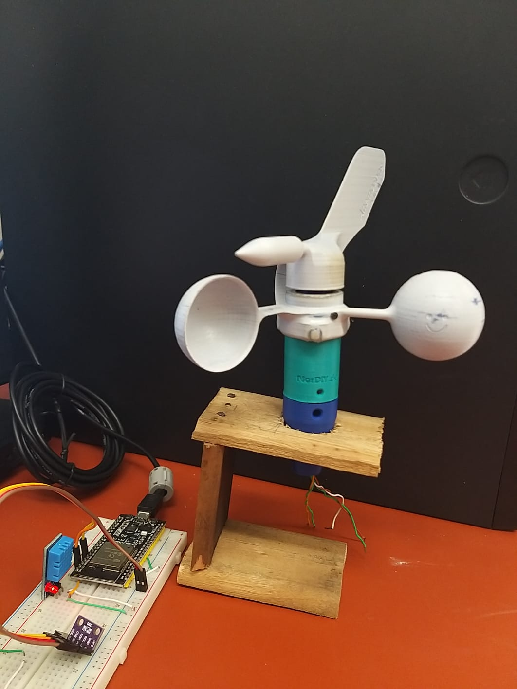

<h1>Estacacao Meteorologica Microcontrolada</h1>
<div></div>


Falar brevemente do projeto....

<h2>MQTT</h2>
https://mosquitto.org/
test.mosquitto.org


<h2>NODE JS</h2>
Caso nao tenha o Node...

```
curl -fsSL https://deb.nodesource.com/setup_lts.x | sudo -E bash
```
```
sudo apt install nodejs
```

<h2>Node-Red</h2>
Instalacao:

```
sudo npm install -g --unsafe-perm node-red
```
Caso use docker:
```
docker run -it -p 1880:1880 --name StationNode nodered/node-red
```
To run node-red locally, in terminal:
```
node-red
```

<h2>InfluxDB</h2>
Instalacao:

```

```
To run node-red locally, in terminal:
```
influxd
```
<h2>Grafana</h2>
sudo apt-get install -y adduser libfontconfig1 musl
wget https://dl.grafana.com/enterprise/release/grafana-enterprise_10.4.2_amd64.deb
sudo dpkg -i grafana-enterprise_10.4.2_amd64.deb

<h2>Microcontroladores</h2>
